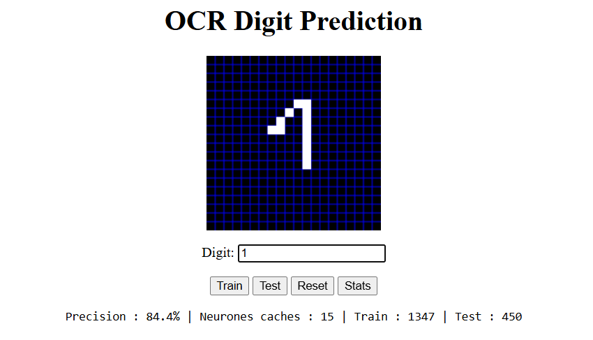

# OCR Digit Prediction

> [Français](README.fr.md)

Personal project : an optical character recognition system for digits (0-9) built on an artificial neural network (ANN), using a client-server architecture.

---

## Preview

Drawing interface with a 20x20 pixel canvas and real-time metrics display.



Sending training data to the server.


---

## Architecture

The project consists of three Python files and a web frontend :

- **`ocr.py`** : defines the `OCRNeuralNetwork` class, which implements a two-layer neural network (one hidden layer, one output layer). It handles weight initialization, backpropagation training, prediction, and weight persistence in `nn.json`.

- **`server.py`** : starts an HTTP server on `localhost:8000`. It loads the handwritten digit dataset, trains the network on startup (or loads existing weights), and exposes two POST endpoints : one for training from the browser, one for predicting a drawn digit.

- **`neural_network_design.py`** : contains a `test()` utility function to evaluate network accuracy on a validation set, averaged over 100 passes.

---

## How it works

1. The user draws a digit on the HTML canvas (20x20 pixels).
2. The frontend sends the image to the server as an array of 400 float values (between 0 and 1).
3. The server passes the image through the neural network and returns the predicted digit (0-9).
4. The user can also correct a wrong prediction : the frontend sends the data back with the correct label to retrain the network in real time.

---

## Neural network

The network uses a simple feedforward architecture :

- Input layer : 400 neurons (one per pixel)
- Hidden layer : 15 neurons (configurable)
- Output layer : 10 neurons (one per digit 0-9)

The activation function is the sigmoid. Training uses gradient descent with a learning rate of 0.1.

---

## Results and observations

Metrics obtained on the sklearn digits dataset (1797 images total) :

| Metric | Value |
|---|---|
| Accuracy | 84.4% |
| Hidden nodes | 15 |
| Training set | 1347 images (75%) |
| Test set | 450 images (25%) |

**Interpretation :**

- **84.4%** is reasonable for such a simple network trained without a framework and on limited data. It means roughly 1 digit in 6 is misclassified.
- Accuracy is averaged over 100 passes to smooth out variations due to random weight initialization.
- The network performs better on well-formed, centered digits. Unusual handwriting styles or off-center drawings are more often misclassified.
- The sklearn digits dataset contains 8x8 images resized to 20x20, which introduces a slight quality loss compared to data drawn directly by hand.

---

## Optimization ideas

- **Increase hidden nodes** : going from 15 to 25-30 would improve the model's ability to represent complex patterns, at the cost of longer training.
- **Use a better dataset** : replacing sklearn digits (8x8) with MNIST (28x28, 70,000 images) would bring more diversity and better generalization.
- **Use an adaptive learning rate** : the fixed 0.1 rate can be too high or too low depending on the training stage. An optimizer like Adam adjusts this automatically.
- **Add more hidden layers** : a single hidden layer limits the network's capacity to learn abstract representations. Two layers often improve performance.
- **Normalize input data** : pixel values are not always in the same range depending on how the user draws. Strict normalization stabilizes training.
- **Add data augmentation** : generating slightly shifted, rotated, or thickened variants of drawn images would help the network handle different writing styles.

**Main limitation** : the current architecture (dense ANN) does not account for the spatial structure of the image. A convolutional network (CNN) would be far better suited for handwritten digit recognition and would easily reach 98-99% accuracy on MNIST.

---

## Getting started

```bash
python server.py
```

The server starts on `http://localhost:8000`. Then open the HTML frontend in a browser.

---

## Dependencies

- Python 3
- numpy
- scikit-learn

---

## Reference

- [*OCR in 500L of code*](https://aosabook.org/en/500L/optical-character-recognition-ocr.html)
